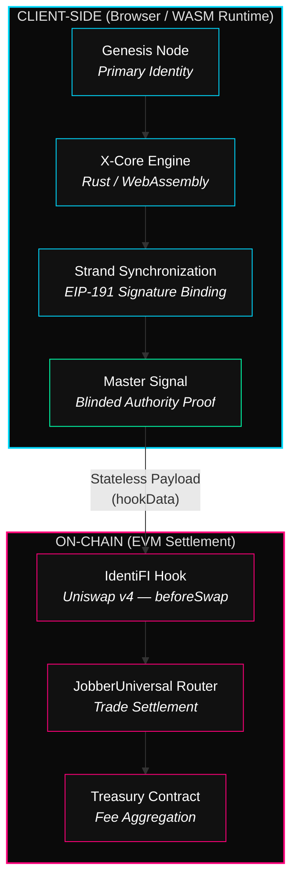
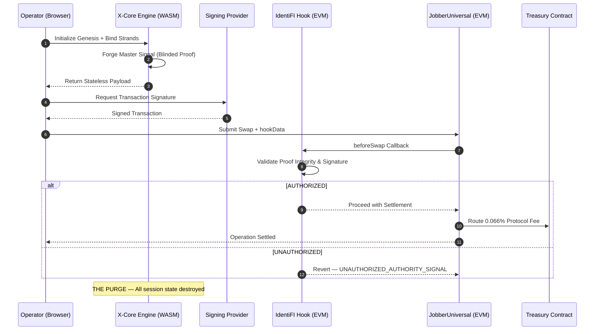

# IdentiFI Protocol

### The Sovereign Identity Engine for the Ethereum Virtual Machine

[](https://www.rust-lang.org/)
[](https://webassembly.org/)
[](https://ethereum.org/)
[](https://uniswap.org/)
[]()

> **"IT'S NOT A WALLET — IT'S A SIGNAL OF POWER."**

---

## Table of Contents

- [Abstract](#abstract)
- [The Problem](#the-problem)
- [Core Architecture](#core-architecture)
- [Execution Flow](#execution-flow)
- [Stateless Reconciliation Layer](#stateless-reconciliation-layer)
- [Security Model](#security-model)
- [Economic Model — The 33/3 Yield Engine](#economic-model--the-333-yield-engine)
- [Integration Surface](#integration-surface)
- [Protocol Parameters](#protocol-parameters)
- [System Requirements](#system-requirements)
- [License & Intellectual Property](#license--intellectual-property)

---

## Abstract

**IdentiFI** is a **Stateless Possession Validation Protocol** — a sovereign cryptographic engine that enables operators to prove unified control over a cluster of EVM wallets without exposing private keys, linking addresses on public explorers, or relying on any centralized infrastructure.

The protocol operates entirely in volatile memory. There are no databases, no server-side logs, no persistent metadata. Every session terminates with a full cryptographic purge. What remains is only the on-chain proof of an authorized operation — nothing else.

Built on **Rust** (compiled to WebAssembly for client-side execution) and natively integrated with **Uniswap v4 Hooks**, IdentiFI represents a new class of DeFi infrastructure: a privacy-preserving authority layer where validation is sovereign, execution is local, and the chain sees only what it needs to see.

This document serves as the protocol's technical overview. It describes the system architecture, security guarantees, and economic model at a level intended for engineering review, audit evaluation, and institutional due diligence.

---

## The Problem

Current DeFi identity and authorization models operate under a fundamental contradiction:

| Constraint | Status Quo | IdentiFI Resolution |
|:--|:--|:--|
| **Multi-Wallet Ownership** | Requires public on-chain linking or centralized registries | Cryptographic cluster proof with zero public linkage |
| **Session Persistence** | Cookies, databases, JWT tokens — all traceable | Volatile memory only. Full purge on termination |
| **Authority Verification** | Trust-based (centralized KYC, oracles) | Trustless, client-forged EIP-191 proofs |
| **Privacy in DeFi Swaps** | Full transaction graph exposure on explorers | Blinded authority payloads via Hook integration |
| **Infrastructure Dependency** | Server-side validation, API keys, uptime risk | 100% client-side execution via WASM. No servers required |

IdentiFI does not patch these problems. It eliminates the architecture that causes them.

---

## Core Architecture

The IdentiFI engine operates on a three-layer execution model. Each layer is isolated by design, ensuring that no single component holds enough state to reconstruct a user's identity or transaction intent.



### Layer I — Client-Side Proof Forging

The **X-Core Engine** is the protocol's computational nucleus. Written in Rust and compiled to WebAssembly, it executes entirely within the user's browser runtime. No network calls are made during proof generation.

- **Genesis Node**: The operator's primary wallet — the root of the identity cluster.
- **Strands**: Secondary wallets bound to the Genesis Node via individual EIP-191 cryptographic signatures.
- **Master Signal**: The final blinded authority payload, generated by cryptographically synchronizing all Strand signatures under the Genesis Node's sovereign key.

### Layer II — On-Chain Validation (Hook Gatekeeper)

The `IdentiFI Hook` is deployed as a Uniswap v4 `beforeSwap` callback. It acts as a **stateless gatekeeper**: it receives the Master Signal via `hookData`, validates the cryptographic integrity of the proof, and either authorizes or reverts the operation. The Hook stores nothing. It validates and exits.

### Layer III — Settlement & Treasury

Upon successful validation, the `JobberUniversal` router settles the trade with maximum gas efficiency. A fixed protocol fee of **0.066%** is captured at the settlement layer and routed to the `IdentiFITreasury` contract for downstream distribution.

---

## Execution Flow

The end-to-end lifecycle of a single IdentiFI-authorized operation:



> **The Purge**: Upon settlement or session termination, all in-memory state — including the Master Signal, Strand signatures, and any intermediate cryptographic material — is irreversibly destroyed. This is not a feature. It is the architecture.

---

## Stateless Reconciliation Layer

Traditional protocols depend on databases to reconcile transactions and attribute revenue. IdentiFI eliminates this dependency entirely through **Fractional Value Reconciliation** — a deterministic, on-chain attribution mechanism.

### How It Works

- **Deterministic Fractional Signatures**: Each transaction processed through the protocol receives a unique sub-decimal value attribution (e.g., `132.333333 USDC`). This fractional component acts as a cryptographic pointer, enabling precise reconciliation against blockchain state without any off-chain storage.

- **Privacy-Preserving Accounting**: Public explorers display only standard ERC-20 transfers. The fractional attribution is invisible to passive observers, preventing metadata linkage and transaction graph analysis.

- **Redundant RPC Mesh**: Signal availability is maintained through triple-node redundancy (3 independent RPC endpoints per network) across 5 major EVM chains. This architecture ensures operational continuity even during infrastructure degradation events.

---

## Security Model

IdentiFI's security posture is grounded in **engineering discipline**, not obscurity. Every guarantee described below is a direct consequence of the system's architectural constraints.

### Cryptographic Guarantees

| Mechanism | Implementation | Threat Mitigated |
|:--|:--|:--|
| **EIP-191 Signed Proofs** | Each Strand produces a standard Ethereum signature binding it to the Genesis Node | Forged authority claims |
| **Temporal Binding** | Proofs are anchored to strict temporal windows derived from on-chain block state | Replay attacks |
| **Nonce Salting** | One-time nonces derived from `recentBlockHash + validatorTimestamp` | Signal interception & reuse |
| **Proof Size Enforcement** | Master Signal payloads are constrained to strict byte boundaries | Injection & overflow attacks |
| **Memory Isolation** | All cryptographic operations execute within the WASM sandbox — no DOM access, no network I/O | Side-channel leakage |

### Architectural Guarantees

- **Zero Persistence**: No database, no cache, no local storage, no cookies. The system is incapable of retaining state beyond the active session.
- **Client-Side Sovereignty**: Proof generation occurs exclusively in the operator's browser. The protocol has no server component that touches cryptographic material.
- **Validator-Executor Separation**: The on-chain Hook (validator) and Router (executor) are architecturally decoupled. The Hook cannot settle trades; the Router cannot validate proofs. Neither holds state.
- **The Purge Protocol**: Session termination triggers immediate, irreversible destruction of all in-memory cryptographic material. This includes the Master Signal, all Strand signatures, and any intermediate computation artifacts.

### What We Don't Do

- We do not rely on trusted third parties, oracles, or off-chain attestation services.
- We do not store, transmit, or log any user-identifying information at any layer.
- We do not expose internal proof-generation logic. The WASM binary is a compiled, sealed execution unit.

---

## Economic Model — The 33/3 Yield Engine

IdentiFI operates on a **Pure Utility Economy**. There is no native token. There is no speculation vector. Protocol revenue is generated exclusively through usage fees and redistributed to validated participants in real assets.

### Revenue Streams

The protocol captures value through three primary channels:

| Channel | Description |
|:--|:--|
| **IdentiFI Core (Generator)** | Premium proof generation and advanced cluster management via the sovereign portal |
| **SDK Integration Fees** | Fee-sharing with partner dApps utilizing the IdentiFI Authority Layer for swap gating |
| **Hook Settlement Fees** | Automated fee capture from every swap routed through IdentiFI-enabled Uniswap v4 pools |

### The 33/3 Distribution Model

```
┌─────────────────────────────────────────────────┐
│           GROSS PROTOCOL REVENUE                │
│     (Core + SDK + Hook Settlement Fees)         │
└────────────────────┬────────────────────────────┘
                     │
                     ▼
        ┌────────────────────────┐
        │   33% → Distribution   │
        │   Pool (Quarterly)     │
        └───────────┬────────────┘
                    │
            ┌───────┴───────┐
            ▼               ▼
     ┌────────────┐  ┌────────────┐
     │  Validated  │  │ Liquidity  │
     │  Swappers   │  │ Providers  │
     │   (50%)     │  │   (50%)    │
     └────────────┘  └────────────┘

        ┌────────────────────────┐
        │   67% → Protocol       │
        │   Treasury (R&D +      │
        │   Operations)          │
        └────────────────────────┘
```

### Distribution Mechanics

- **Quarterly Epochs**: Revenue distribution occurs on a fixed 3-month cycle, ensuring sustainable and predictable yield.
- **Anti-Sybil Enforcement**: Only operators validated through the X-Core Engine are eligible for distribution. The same stateless proof mechanism that gates swaps also gates yield claims — preventing bot farms and sybil attacks on the reward pool.
- **Real Asset Settlement**: All distributions are denominated and settled in **USDC**. No synthetic tokens, no vesting, no governance theater.
- **Privacy-Preserving Claims**: The claim process maintains the Master Signal's integrity. There is no linkage between the reward transaction and the operator's cluster identity.

---

## Integration Surface

IdentiFI exposes a minimal, high-performance integration surface for third-party dApps and liquidity protocols.

| Capability | Technical Specification |
|:--|:--|
| **WASM Proof Validation** | Client-side verification at native speed. Zero network latency |
| **Universal Authority Layer** | Cross-pool liquidity authorization without fund movement or wallet linking |
| **SkinWalker Protocol** | Instant cryptographic signature rotation on cluster compromise detection |
| **Hook-Native Settlement** | Direct integration with Uniswap v4 `beforeSwap` lifecycle for atomic validation |

> Integration documentation and SDK access are available under NDA. Contact the IdentiFI engineering team for evaluation access.

---

## Protocol Parameters

The following parameters are enforced at the contract and engine level. They are not configurable at runtime.

| Parameter | Value | Enforcement Layer |
|:--|:--|:--|
| Protocol Swap Fee | **0.066%** | Settlement Contract (`JobberUniversal`) |
| Yield Distribution Ratio | **33/3** (33% quarterly) | Treasury Contract |
| Distribution Split | **50/50** (Swappers / LPs) | Treasury Contract |
| Proof Size Constraints | **Minimum 1,100 bytes** | X-Core Engine (WASM) |
| Supported Networks | **5 EVM Chains** (Triple RPC Redundancy) | Client Configuration |
| Session Persistence | **None** (Volatile Memory Only) | Architecture (Enforced) |

---

## System Requirements

| Dependency | Minimum Version | Purpose |
|:--|:--|:--|
| Node.js | 16+ | Development toolchain & build orchestration |
| Rust | 1.70+ | X-Core Engine compilation |
| wasm-pack | Latest | Rust → WebAssembly compilation target |
| Web3 Wallet | MetaMask or compatible | EIP-191 signature provider |

---

## License & Intellectual Property

IdentiFI Protocol is **proprietary software**. All source code, compiled binaries, cryptographic algorithms, and architectural designs are the exclusive intellectual property of the IdentiFI engineering team.

- **Source Code**: Not licensed for redistribution, modification, or derivative works without explicit written authorization.
- **WASM Binaries**: Compiled, sealed execution units. Reverse engineering, decompilation, or binary analysis is strictly prohibited.
- **Documentation**: This document is provided for technical evaluation purposes only. Reproduction requires authorization.

For security disclosures, see `SECURITY.md`.  
For licensing inquiries, contact the IdentiFI engineering team.

---

<p align="center">
  <br/>
  <strong>IdentiFI Protocol</strong><br/>
  <em>The First Stateless EVM Privacy Engine</em><br/>
  <br/>
  <code>Status: OPERATIONAL</code>&nbsp;&nbsp;|&nbsp;&nbsp;<code>Engine: X-Core v1.01 (Rust/WASM)</code>&nbsp;&nbsp;|&nbsp;&nbsp;<code>Compliance: 100% Stateless</code>
  <br/><br/>
  © 2026 IdentiFI Protocol — All Rights Reserved.
</p>
